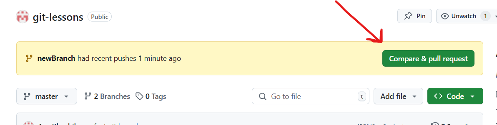
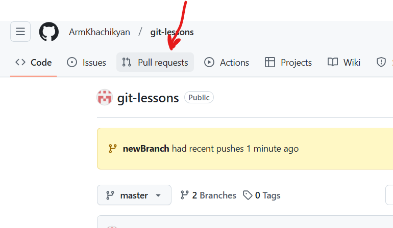
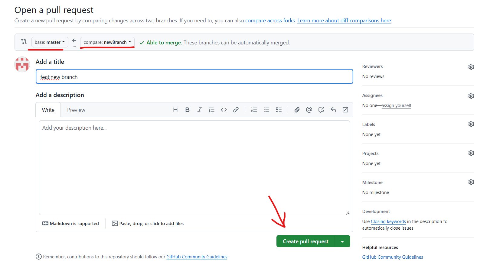
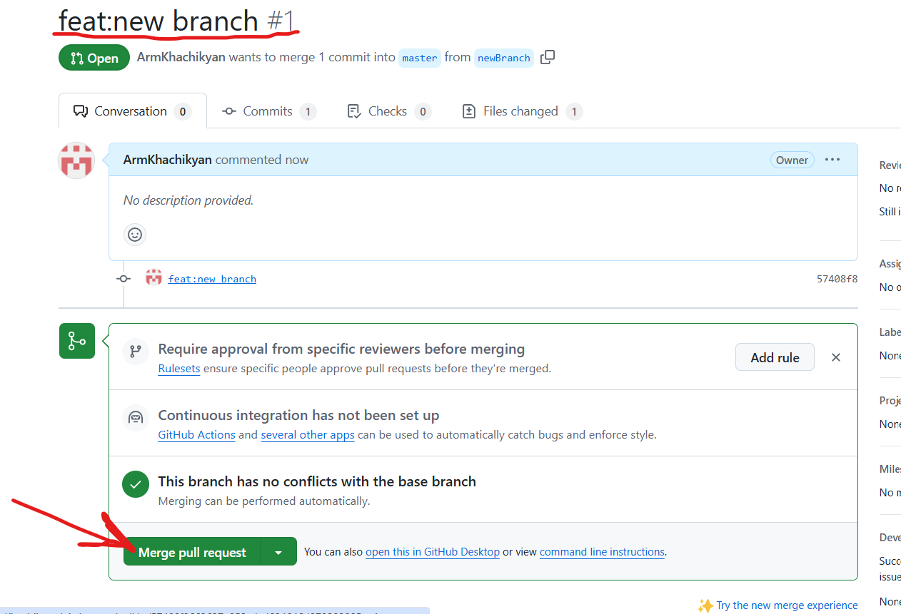

# Getting Started with GIT

### For initialization new project use this command

```
    git init
```

### For adding changes in project use this command

```
    git add .
```

### For commiting changes in project use this command

```
    git commit -m 'commit type: command desc'
```


### For pushing  in project use this command

```
    git push 
```
### for checking git branch use this command
```
    git branch
```  


### for creating new  git branch and changed direct to  that branch use this command
```
    git checkout -b <branch name> 
```  


### For opening Pull request (PR) use this
 

#### Or this one
 

#### And finally open PR from one branch to other
 

#### Here is your PR and you can merge it now



### for checkouting already existed branch use this command
```
git checkout <branch name>
```
